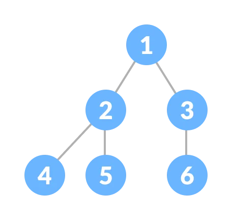

## 1. Properties of binary tree

[1] Maximum number of nodes at level $l$ is equal to $2^{l}$ <br>
  
Where level $l$ is the number of nodes on the path from the root to the node. The level of the root node is 0

  > Proof : This can be proved by induction. <br> 
  For root node, $l = 0$, maximum number of nodes is $2^0 = 1$ <br>
  Assume that the maximum number of nodes at level $l$ is $2^l$ <br>
  Since in a binary tree every node has at most 2 children, the next level would have twice nodes : $2 \cdot 2^l = 2^{l+1}$

  Note : if the level of the root node is considered as 1, the above formula becomes $2^{l-1}$

[2] Maximum number of nodes in a binary tree of height $h$ is $2^h - 1$ <br>
  
Where height of a tree is the number of nodes from the root node to the deepest leaf. The height of a tree with only one node is 1.

  > Proof : We use the result we prove in [1]. The maximum number of nodes at each level is $2^{l}$. Therefore the maximum number of nodes in a binary tree is : $$\displaystyle\sum_{i = 0}^{h-1} 2^i = 2^0 + 2^1 + 2^2 + ... + 2^{h-1}$$
  We recognize the formula of a geometrical series with $h$ terms and with first term equal to 1. The sum of this geometrical series is equal to $2^h - 1$.

  Note : if we considered that the height of the root node is 0, the above formula becomes $2^{h+1} - 1$

[3] In a binary tree with $N$ nodes, the minimum possible height or the minimum number of levels is $log_2(N+1)$

  > Proof : Each level should have at least one node (meaning in the worst case scenario, we have a tree with only one node per level), therefore the height cannot be more than $N$. <br>
  We prove previously that a binary tree of height $h$ has a maximum of $2^h - 1$ nodes. Hence, we have : $$N \leq 2^h - 1 \\ 2^h \geq N + 1 \\ log_2(2^h) \geq log_2(N+1) \\ h \geq log_2(N+1)$$

[4] A binary tree with $L$ leaves has at least $\lceil log_2(L) \rceil + 1$ levels

  > Proof : The number of leaves in a binary tree is maximised and the the number of levels is minimised when all levels are fully fill. Say that all leaves are at a level $l$, we know from [1] that $L \leq 2^{l-1}$ (if we considered that the root node level is 1). Hence, we have : $$L \leq 2^{l-1} \\ log_2(L) \leq log_2(2^l) + log_2(2^{-1}) \\ log_2(L) \leq l - 1 \\ l \geq log_2(L) + 1$$
  Since $l$ is the minimum number of levels, we take the upper integer part of $log_2(L)$ which gives us : $$l = \lceil log_2(L) \rceil + 1$$

[5] In a binary tree where every node have 0 or 2 children (a.k.a full binary tree), the number of leaf nodes is equal to the number of nodes with two children + 1, i.e. $L = T + 1$

Where $L$ is the number of leaf nodes and $T$ the number of internal nodes with two children.

  > Proof : $L$ is the number of leaves present at the last level of the tree (because we know that every node have 0 or 2 children). <br>
  Therefore $L = 2^{h-1}$ (if we consider the level of root node is 1) where $h$ is the height of the tree. <br>
  Since every node have either 0 or 2 children, the total number of nodes is equal to the maximum number of nodes in a binary tree of height $h$, which is $2^h - 1$. Hence, we have : $$T = 2^h - 1 - 2^{h-1} = 2^{h-1}(2-1) - 1 = 2^{h-1} - 1$$
  We conclude : $$T = L - 1 \Leftrightarrow L = T + 1$$

[6] In a non-empty binary tree, if $n$ is the total number of nodes and $e$ is the total number of edges, then $e = n-1$

  trivial
  

## 2. Types of binary tree

### 2.1 Full binary tree

A full binary tree (also known as proper binary tree) is a binary tree in which every parent node has either two or no children.


#### 2.1.1 Properties of full binary tree

$N$ = number of nodes <br>
$I$ = number of internal nodes <br>
$L$ = number of leaves

[1] The number of leaves $L$ is one more than the number of internal nodes $I$, i.e. $L = I + 1$ <br>
[2] The total number of nodes $N$ with $I$ internal nodes is $N = 2I + 1$ <br>
[3] The total number of nodes $N$ with $L$ leaves is $N = 2L - 1$

#### 2.1.2 C code to check whether a tree is a full binary tree

Node struct is defined in the file `tree.c` of this directory.

```c
int is_full(Node *root) {
  // An empty tree is full
  if (root == NULL)
    return 1;

  if (root->left == NULL && root->right == NULL)
    return 1;

  if ((root->left) && (root->right))
    return (is_full(root->left) && is_full(root->right));

  return 0;
}
```

### 2.2 Perfect binary tree

A perfect binary tree is a binary tree in which all internal nodes have two children and all leaves have the same level.


#### 2.2.1 Properties of perfect binary tree

$N$ = number of nodes <br>
$L$ = number of leaves <br>
$h$ = height of tree

[1] The total number of nodes in a perfect binary tree of height $h$ is $2^{h+1} - 1$

  > Proof : We prove in 1.[2] that the maximum number of nodes in a binary tree of height $h$ is $2^{h+1} - 1$ (considering the height of the root node is 1). The number of nodes in a perfect binary tree is maximal, thus the total number of nodes in a perfect binary tree is $2^{h+1} - 1$

[2] The number of leaves $L$ in a perfect tree with $N$ number of nodes is $L = \displaystyle\frac{N+1}{2}$

[3] The number of leaves in a perfect binary tree of height $h$ is $L = 2^h$

  > Proof : We prove it by induction <br>
  Base case : a tree of height 0 has $L = 2^0 = 1$ leaf node which is true. <br>
  Assume that that at height $h$, a perfect binary tree has $2^h$ leaf nodes. Since in a perfect binary tree we double the number of leaf nodes every level, at height $h+1$ the tree will have $2\cdot2^h = 2^{h+1}$ leaf nodes.

#### C code to check whether a tree is a perfect binary tree

Node struct is defined in the file `tree.c` of this directory.

```c
// Calculate the depth
int depth(Node *node) {
  int d = 0;
  while (node != NULL) {
    d++;
    node = node->left;
  }
  return d;
}

// Check if the tree is perfect
int is_perfect(Node *root, int d, int level) {
  if (root == NULL)
    return 1;

  // If it is a leaf node, it should be at the same
  // level of each leaf, which is 'depth'
  if (root->left == NULL && root->right == NULL)
    return (d == level + 1);

  if (root->left == NULL || root->right == NULL)
    return 0;

  return is_perfect(root->left, d, level + 1) &&
       is_perfect(root->right, d, level + 1);
}
```

### 2.3 Complete binary tree

A complete binary tree is a binary tree where all levels except possibly the last one are completely fill, and the last level has all its nodes on the left side.



#### 2.3.1 Creation of a complete binary tree

1. Select the first element of the list to be the root node

<table>
  <tr>
    <th colspan="6">Array</th>
  </tr>
  <tr>
    <td>+9</td>
    <td>2</td>
    <td>7</td>
    <td>3</td>
    <td>5</td>
    <td>6</td>
  </tr>
</table>

```
Generated tree :

      9
```

2. Put the second element as a left child of the root node and the third element as the right child

<table>
  <tr>
    <th colspan="6">Array</th>
  </tr>
  <tr>
    <td>9</td>
    <td>+2</td>
    <td>+7</td>
    <td>3</td>
    <td>5</td>
    <td>6</td>
  </tr>
</table>

```
Generated tree :

        9
      /   \
    2       7
```

3. Put the next two elements as children of the left node of the second level. Again, put the next two elements as children of the right node of the second level

<table>
  <tr>
    <th colspan="6">Array</th>
  </tr>
  <tr>
    <td>9</td>
    <td>2</td>
    <td>7</td>
    <td>+3</td>
    <td>+5</td>
    <td>+6</td>
  </tr>
</table>


```
Generated tree :

        9
      /   \
    2       7
  /  \     /
  3    5   6  
```

4. Keep repeating until you reach the last element.

#### 2.3.2 Properties of complete binary tree

In a complete binary tree, we have a relation between the position in the array of a node and its children. Similarly, we have a relation between the position in the array of a node and its parent.

[1] If the index of a node in the array is $i$, the node with the index $2i+1$ is his left child, and the node with the index $2i+2$ is his right child

  > Example : Node 9 is at index $i = 0$ in the array. <br> 
  His left child, the node 2 is at index $2i+1 = 2\cdot0+1 = 1$ which is true. <br>
  His right child, the node 7 is at index $2i+2 = 2\cdot0+2 = 2$, also true !

[2] The parent node of any node at index $i$ is $\lfloor \displaystyle\frac{i-1}{2} \rfloor$

  > Example : Check the formula for the node 5 at index $i = 4$ <br>
  $\lfloor \displaystyle\frac{4-1}{2} \rfloor = \lfloor 1.5 \rfloor = 1$. His parent, the node 2 is indeed at index 1.

#### 2.3.3 C code to check whether a tree is a complete binary tree

Node struct is defined in the file `tree.c` of this directory.

```c
int count_nodes(Node *root) {
  if (root == NULL)
    return (0);
  return (1 + count_nodes(root->left) + count_nodes(root->right));
}

int is_complete(Node *root, int index, int numberNodes) {
  if (root == NULL)
    return 1;

  if (index >= numberNodes)
    return 0;

  return (is_complete(root->left, 2 * index + 1, numberNodes) && is_complete(root->right, 2 * index + 2, numberNodes));
}
```

### Balanced binary tree

A balanced binary tree (also known as heigh-balanced binary tree) is a binary tree in which the height of the left and the right subtree of any node differ by not more than 1.


#### C code to check whether a binary tree is balanced

```c
int is_balanced(Node *root, int *height) {
  int leftHeight = 0, rightHeight = 0;
  int l = 0, r = 0;

  if (root == NULL) {
    *height = 0;
    return 1;
  }

  l = is_balanced(root->left, &leftHeight);
  r = is_balanced(root->right, &rightHeight);

  *height = (leftHeight > rightHeight ? leftHeight : rightHeight) + 1;

  if ((leftHeight - rightHeight >= 2) || (rightHeight - leftHeight >= 2))
    return 0;
  else
    return l && r;
}
```

## Sources

[[1] Binary Tree Inductive Proofs, Dominic Farolino's blog](https://blog.domfarolino.com/Binary-Tree-Inductive-Proofs/) <br>
[[2] Properties of Binary Tree, GeeksforGeeks](https://www.geeksforgeeks.org/properties-of-binary-tree/) <br>
[[3] Tree based DSA (I), Programiz](https://www.programiz.com/dsa/)